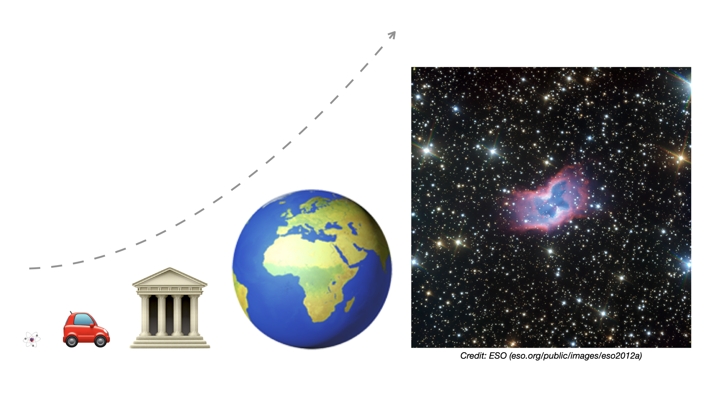
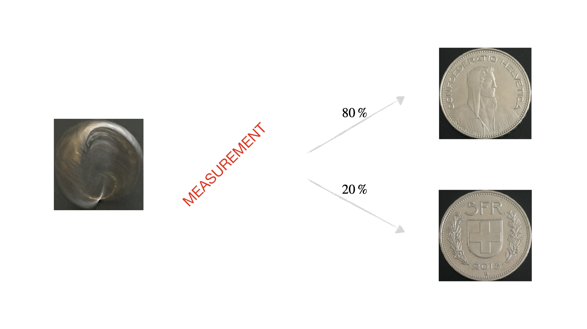
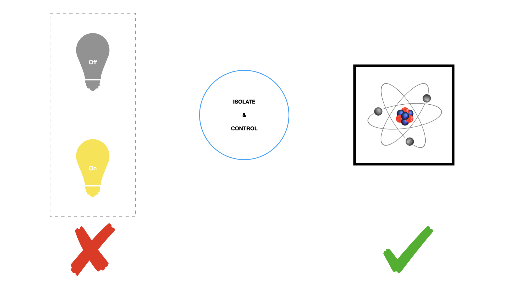

# Quantum mechanics for developers - Part 1

The goal of this article is to introduce quantum mechanics in a gentle way, on the logical level, to prospective programmers of quantum computers. In [Part 1](qm-for-developers-part-1.md), the big picture is given, with a qualitative description of superposition and measurement. Then, in [Part 2](qm-for-developers-part-2.md) we mathematically define these concepts, as well as the qubit, the basic unit of quantum information processing. Finally, [Part 3](qm-for-developers-part-3.md) discusses multi-qubit systems and entanglement.

> [!TIP]
> Don't worry if not everything is crystal clear in [Part 1](qm-for-developers-part-1.md). It will all be made precise in the subsequent parts.

## Brief history

Over the course of the 19th century, physicists discovered several [*baffling phenomena*](https://en.wikipedia.org/wiki/History_of_quantum_mechanics) that contemporary physical theories could not explain. These led them to the realization, around the turn of the 20th century, that a brand new physical theory was needed to describe nature at the atomic and subatomic scales. The new theory was called **quantum mechanics**, and it was developed gradually during the first decades of the 20th century.

As it turns out, quantum mechanics possesses an odd duality. On the one hand, it works: the predictions that follow from its laws have been tested with great success for many decades now. On the other hand, nobody really understands what those laws actually mean: they seem to be against all human intuition. That's why, from the very beginning until today, physicists and philosophers find it difficult, if not impossible, to come to terms with the theory.

## Superposition, the source of all weirdness

At the very heart of quantum mechanics lies the phenomenon of **superposition**, where it appears as if physical objects could exist in more than one mutually exclusive states at the same time. This sounds weird, since according to our day-to-day experience, a light bulb can be either on or off, a cat can be either dead or alive, a bit in our computer can be either 0 or 1, and a particle can be at exactly one location, at any given point in time. It’s kind of difficult to imagine how it could be otherwise; e.g. what would we see if we observed a light bulb that is both on and off at the same time?

> [!NOTE]
> It may seem hair-splitting, but precisely defining the states of macroscopic objects can be tricky. You might have noticed that e.g. the "on" state corresponds to zillions of (mutually exclusive) subatomic configurations of the light bulb. If this troubles you, just pick any single one of those fundamental, subatomic configurations and label only that as the "on" state. Similar applies to the "off" state.

As counterintuitive as it may sound, superposition is a well-established experimental fact that has been confirmed in countless experiments during the past 100 years or so. The best we can do is to accept it and get used to it, and see how we can use it for practical purposes. But wait a moment: didn't we say that quantum mechanics is the theory of the atomic and subatomic scales? So all these experiments must have been done at the atomic scale and below, right? That's correct, however, as we'll see it later, the reason for that is merely technological, rather than theoretical. Theoretically, macroscopic objects such as a light bulb are also made up of atoms and elementary particles...

Indeed, there is nothing in quantum mechanics that would restrict its validity to the sub-microscopic domain. As far as we can tell today, quantum mechanics is a general theory that applies to **all scales**, let it be atoms, buildings, or galaxies.

According to quantum mechanics, **ANY physical system can be in superposition of its incompatible classical states**. By „classical state“ we mean informally any property which makes sense in classical physics, such as position, orientation, or energy. By „incompatible“ we mean mutually exclusive states, that is, states which according to classical physics cannot occur simultaneously. For example, it’s common sense that a particle cannot be in two places at the same time, a person cannot face forward and backward at the same time, and an atom has one internal energy at any point in time.

Superposition is one of the revolutionary ideas of quantum mechanics: the realization that even incompatible classical states can co-exist simultaneously. So yes, in a sense (see Note below), a particle *can* be here and there at the same time, a person *can* face forward and backward at the same time, and an atom *can* have multiple internal energies at once. Whenever this happens, we say that the physical system is in a *superposition state*. Furthermore, in quantum mechanics, all the possible states of any physical system can be expressed **either as classical states or superpositions thereof**.

> [!NOTE]
> It's still an open question today what superposition *really* means in terms of the underlying physical reality. To be precise, when we say that an object exists "in more than one incompatible classical states at the same time", it is just a **logical** way to imagine superposition, similar to saying that the transistor carries either 0 or 1. In this article, we'll stick with this picture of superposition most of the time, because it's convenient to use when solving problems in quantum computing. There are also other, logically equivalent ways to imagine superposition. As an example, instead of saying that a coin in superposition is *both* heads and tails at the same time, we may also insist it's *neither* heads *nor* tails, but analogous to a [*spinning coin*](https://www.houstonchronicle.com/techburger/article/Entrepreneur-bringing-strange-quantum-computing-13212294.php), i.e. heads and tails "blended" together. We'll come back to this point in [Part 2](qm-for-developers-part-2.md).

## Measurement & collapse

Assume we'd like to find out the value of a classical property. Then, we have to measure it! This may simply be done just by looking, e.g. to see whether a person is facing forward or backward. Or, we may need a device, e.g. to measure the internal energy of an atom.

Ok, but what if we do our measurement on a system that happens to be in a superposition state? What will we, or our device, see? The answer is, again, weird: **the superposition state will immediately and randomly collapse into one of its classical states**, and the system will stay permanently in that classical state afterwards. So, superposition or not, we'll only ever end up with and see classical states.

For example, if we measure a coin that is in a superposition of heads and tails, then a measurement will randomly collapse it into either heads or tails. The exact probabilities depend on the superposition state itself; it can be e.g. a 50-50% chance, or 80% chance for heads and 20% for tails, or just any pair of non-zero probabilities that add up to 100%. (The classical state heads can be thought of as a degenerate superposition state, where there is 100% chance to "collapse" into heads, and 0% chance, i.e. no chance, to end up with tails. Similar applies to the classical state tails.)

> [!NOTE]
> From an IT perspective, measurement means interacting with the system until we get the information we want. In this sense, it's not totally surprising that such an "interrogation" collapses the superposition... we can think of it as a way by which nature provides us with the information that we, or our devices, are prepared to see. But this is merely speculation; the mechanism behind the collapse is still a mystery today.

Below is an illustration of measurement, where superposition is depicted as a spinning coin. Just to reiterate: this is only an *illustration*, the spinning coin is NOT a real superposition... it's an analogy. Nobody knows how to imagine superposition "correctly".

Finally, the fact that there are probabilities assigned to the classical states of a superposition suggests that mathematically, superposition could be represented as a weighted combination of classical states. This insight will be made precise in [Part 2](qm-for-developers-part-2.md), but, of course, with a weird twist.

## What about everyday life?

Congratulations, you've made it to the last section! Here is the million-dollar question: if superposition is possible at all scales, why don't we experience quantum effects in our daily lives? Well, this is a valid point, and the reason behind it is not yet fully understood. (I guess such a statement doesn't surprise you anymore, does it? Welcome to the frontiers of physics.)

Here is a more-or-less standard, popular explanation:

Remember from the previous section that whenever we measure a superposition state, it immediately collapses due to our interacting with it, and we end up randomly with a classical state. Now, something similar is happening in our everyday life: as nothing is isolated, **the environment keeps interacting with us, in such an uncontrolled way that basically amounts to "measuring" us**, as well as the objects around us, all the time. (Again, we'll make it more precise in [Part 2](qm-for-developers-part-2.md) what "uncontrolled" means.) So no macroscopic object has a chance to remain in a coherent superposition, for any noticeable amount of time.

To produce, maintain and manipulate superposition, extreme levels of isolation and control are needed. Today, we only have the technology to achieve this at the sub-microscopic scale, but not yet for light bulbs, buildings, let alone galaxies. But in principle, it’s possible at any scale!

## Next steps

- Set up [Microsoft Quantum Development Kit (QDK)](https://docs.microsoft.com/quantum/quickstarts/)
- Continue with [Quantum mechanics for developers - Part 2](qm-for-developers-part-2.md)
- Optionally, read the essay [Schrödinger's cat in 1 minute](https://q-edu-lab.com/2019/10/01/schroedingers-cat-in-1-minute/)
