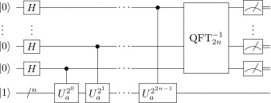

## Period Finding ##

Now that we have seen how the quantum Fourier transform and phase estimation work, we can use these tools to solve a classically hard computational problem called *t period finding*.  In the next section, we will see how to apply period finding to factoring.

Given two integers $a$ and $N$, where $a<N$, the goal of period finding, also called order finding, is to find the {\it order} $r$ of $a$ modulo $N$, where $r$ is defined to be the least positive integer such that $a^r \equiv 1 \text{ mod } N$.  

To find the order using a quantum computer, we can use the phase estimation algorithm applied to the following unitary operator $U_a$:
$$ U_a|x\rangle \equiv |(ax)\text{ mod }N\rangle .$$
The eigenvectors of $U_a$ are for integer $s$ and $0\leq s \leq r - 1$,
$$|x_s\rangle \equiv 1 / \sqrt{r} \sum\_{k=0}^{r-1} e^{\frac{-2\pi i sk}{r}} | a^k \text{ mod } N \rangle,$$ are {\it eigenstates} of $U_a$.
The eigenvalues of $U_a$ are
$$ U\_a |x\_s\rangle = e^{2\pi i s / r} | x\_s \rangle . $$

Phase estimation thus outputs the eigenvalues $e^{2\pi i s / r}$ from which $r$ can be learned efficiently using [{\it continued fractions}](https://en.wikipedia.org/wiki/Continued_fraction) from $s / r$.

Below is the circuit diagram for quantum period finding:

Here $2n$ qubits are initialized to $|0\rangle$ and $n$ qubits are initialized to $|1\rangle$.
The advanced reader again may wonder why the quantum register to hold the eigenstates is initialized to $|1\rangle$.
As one does not know the order $r$ in advance, we cannot actually prepare $|x_s\rangle$ states directly.
Luckily, it turns out that $1/\sqrt{r} \sum\_{s=0}^{r-1} |x\_s\rangle = |1\rangle$.
We don't need to actually prepare $|x\rangle$!  
We can just prepare a quantum register of $n$ qubits in state $|1\rangle$. 

The circuit contains the QFT and several controlled gates.
The QFT gate has been described [previously](./algorithms.md).  
The controlled-$U_a$ gate maps $|x\rangle$ to $|(ax)\text{ mod } N\rangle$ if the control qubit is $|1\rangle$, and maps $|x\rangle$ to $|x\rangle$ otherwise.

To achieve $(a^nx)\text{ mod } N$,  we can simply apply controlled-$U_{a^n}$, where we calculate $a^n \text{ mod } N$ classically to plug into the quantum circuit.  
The circuits to achieve such modular arithmetic have been described in the [quantum arithmetic documentation](./algorithms.md), specifically we require a modular exponentiation circuit to implement the controlled-$U\_{a^i}$ operations.

While the circuit above explicitly enables order finding, we can reduce the number of qubits required by following Beauregard's method for order finding.  Rather than using $2n$ control qubits, Beauregard shows how to achieve order finding with only one single control qubit.
The circuit performs the quantum Fourier transform semi-classically through a sequence of operations conditional on the measurement results. 

To perform the space-optimized version of the algorithm, we first note we can perform the modular exponentiation of a constant $a$ by a quantum superposition of values $x$ stored in a quantum register of $2n$ qubits.  
Here $n=\left \lceil {\log\_2 N} \right \rceil$.  
We denote the quantum register of $2n$ qubits as $|x\rangle$.
We will compute the result into a separate register, denoted $|0\rangle$.

The mapping we wish to achieve is the following:
$$ |x\rangle |0\rangle \rightarrow |x\rangle |a^x \text{ mod } N\rangle . $$
We can compute this mapping using $2n$ conditional modular multiplications.
In turn, each modular multiplication can be computed using $n$ modular additions, as described in the ARITHMETIC SECTION REF.

The quantum circuit below outlines the sequence of quantum gate operations:

The circuit requires several phase-shift gate operations $R_k$, given by:
$$ R_k = \left [ \begin{matrix}  1 & 0 \\ 0 & e^{i\theta_k}  \end{matrix} \right ],$$
where $\theta_k = -\pi \sum_{j=0}^{k-1} 2^{k-j}m_i$, where the sum runs over all previous measurements $j$ and $m_j\in{0,1}$ denotes the given measurement result.  That is, $m_0$ represents the least significant bit of the final result, and is extracted during the first measurement.  These gates are thus classically controlled gate operations, conditioned on the previous measurement results.  Together, they perform the inverse quantum Fourier transform.
 
\section{Factoring}
The goal of factoring is to determine the two prime factors of integer $N$, where $N$ is an $n$-bit number.  
Factoring consists of three parts: (1) a classical preprocessing routine; (2) a quantum computing routine to find the order of $a \text{ mod } N$; and (3) a classical preprocessing routine to derive the prime factors from the order.

The classical preprocessing routine consists of the following steps:
\begin{enumerate}
\item If $N$ is even, return the prime factor $2$.
\item If $N=p^q$ for $p\geq1$, $q\geq2$, return the prime factor $p$.  This step can be performed classically.
\item Choose a random number $a$ such that $1<a\leq N-1$.
\item If $\mbox{gcd}(a,N)>1$, return the prime factor $\mbox{gcd}(a,N)$. This step can be computed using Euclid's algorithm.
\end{enumerate}

If no prime factor has been returned, we proceed to the quantum routine:
\begin{enumerate}
\setcounter{enumi}{4}
\item Call the quantum period finding algorithm to calculate the order $r$ of $a \text{ mod } N$. Return $r$.
\end{enumerate}

Finally, we perform a classical postprocessing routine to determine the prime factors:
\begin{enumerate}
\setcounter{enumi}{5}
\item If $r$ is odd, go back to preprocessing step (3).
\item If $r$ is even and $a^{r/2} = -1\text{ mod }N$, go back to preprocessing step (3).
\item If $\mbox{gcd}(a^{r/2}+1, N)$ is a prime factor of $N$, return $\mbox{gcd}(a^{r/2}+1, N)$.
\item If $\mbox{gcd}(a^{r/2}-1, N)$ is a prime factor of $N$, return $\mbox{gcd}(a^{r/2}-1, N)$.
\end{enumerate}

The factoring algorithm is probabilistic: it can been shown that with probability at least one half that $r$ will be even and $a^{r/2} \neq -1 \text{ mod }N$, thus producing a prime factor.  (See Shor's original paper for details, or Nielsen and Chuang).  If a prime factor is not returned, then we simply repeat the algorithm from step (1).