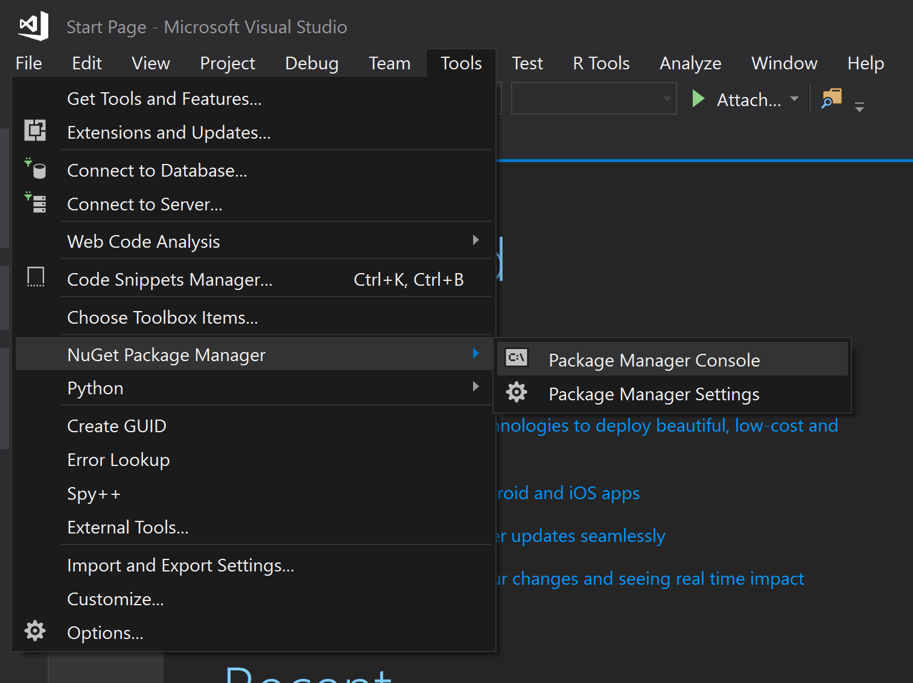

# Numerics Library Installation and Validation

The Quantum Development Kit provides support for numerics functionality through the [`Microsoft.Quantum.Numerics`](https://www.nuget.org/packages/Microsoft.Quantum.Numerics) NuGet package.

**Visual Studio >=2019:** If you are using Visual Studio 2019 or later, you can add the numerics package using the NuGet Package Manager.
To do so, select "Manage NuGet Packages..." from the "Project" menu item in Visual Studio.

From the Browse tab, search for the package name "Microsoft.Quantum.Numerics"

> [!NOTE]
> Make sure to tick "Include prerelease"

This will list the packages available for download.
Hovering over "Microsoft.Quantum.Numerics" reveals a downward-pointing arrow to the right of the version number.
Click on the arrow in order to install the numerics package.

For more details, see the [Package Manager UI guide](https://docs.microsoft.com/nuget/tools/package-manager-ui).

Alternatively, you can use the Package Manager Console to add the numerics library to your project via the command line interface.



From the package manager console, run the following:

```
Install-Package Microsoft.Quantum.Numerics
```

For more details, see the [Package Manager Console guide](https://docs.microsoft.com/nuget/tools/package-manager-console).

**Command line or Visual Studio Code:** Using the command line on its own or from within Visual Studio Code, you can use the `dotnet` command to add NuGet package reference to your project:

```dotnetcli
dotnet add package Microsoft.Quantum.Numerics
```


## Verifying your installation

Like the rest of the Quantum Development Kit, the numerics library comes with samples that help you get started as quickly as possible.
To test your installation using these samples, clone the [main samples repository](https://github.com/Microsoft/Quantum) and then run one of the samples.

To run the [`CustomModAdd`](https://github.com/microsoft/Quantum/tree/master/samples/numerics/CustomModAdd) sample:

```bash
git clone https://github.com/Microsoft/Quantum.git
cd Quantum/samples/numerics/CustomModAdd
dotnet run
```
