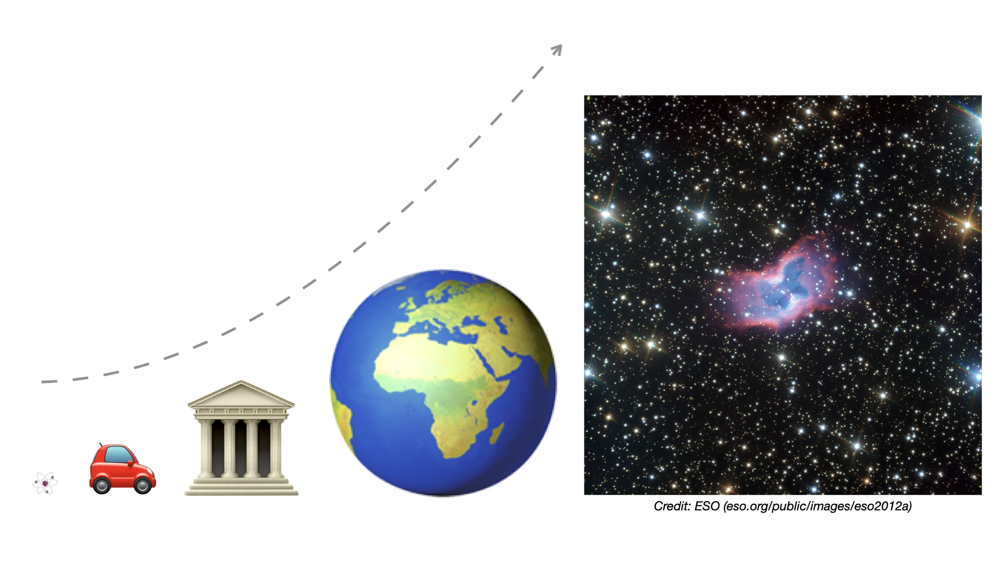

# Quantum mechanics via Q# snippets - Part 1

The goal of this article is to introduce quantum mechanics in a gentle way, on the logical level, to prospective programmers of quantum computers. To make it easier to understand the material, the new concepts are accompanied by simple [Q#](https://docs.microsoft.com/quantum/overview/what-is-qsharp-and-qdk) code snippets. That said, **no prior knowledge of Q# is needed** to be able to follow the content.

The topic of [Part 1](quantum-mechanics-via-qsharp-snippets-part-1.md) is superposition, which is the revolutionary idea at the heart of quantum mechanics. After a brief historical overview, we first give a qualitative, and later a mathematical description of superposition.

> [!TIP]
> If you'd like to run the Q# snippets as they come in the article, you may want to set up [Microsoft Quantum Development Kit (QDK)](https://docs.microsoft.com/quantum/quickstarts/) now. Here, we're going to use QDK via [Binder](https://docs.microsoft.com/quantum/quickstarts/install-binder), which is an online Jupyter Notebook option that doesn't require any local installation.

## Brief history

Over the course of the 19th century, physicists discovered several [baffling phenomena](https://en.wikipedia.org/wiki/History_of_quantum_mechanics) that contemporary theories could not explain. These led them to the realization, around the turn of the 20th century, that a brand new physical theory was needed to describe nature at the atomic and subatomic scales. The new theory was called **quantum mechanics**, and it was developed gradually during the first decades of the 20th century.

Then, in the 1980s, it was conjectured that quantum physical effects could be harnessed to do more efficient information processing. Since then, mounting theoretical evidence strongly supports that this is indeed the case. On the practical side, there already exist early-stage **quantum computers**, accessible via the cloud (see e.g. [Azure Quantum](https://azure.microsoft.com/services/quantum/)), whose hardware is capable of producing quantum effects, such as superposition.

As it turns out, quantum mechanics possesses an odd duality. On the one hand, it works: the predictions that follow from its laws have been tested with great success for many decades now. On the other hand, nobody really understands what those laws actually mean: they seem to be against all human intuition. That's why, from the very beginning until today, physicists and philosophers find it difficult, if not impossible, to come to terms with the theory.

## Superposition, the source of all weirdness

At the very heart of quantum mechanics lies the phenomenon of **superposition**, where a physical object *appears to exist* in more than one mutually exclusive states at the same time. This sounds weird, since according to our day-to-day experience, a light bulb can be either on or off, a cat can be either dead or alive, a bit in our computer can be either 0 or 1, and a particle can be at exactly one location, at any given point in time. It’s kind of difficult to imagine how it could be otherwise; e.g. what would we see if we observed a light bulb that is both on and off at the same time?

In the previous paragraph, we used the term "appears to exist", because it's still an open question today what superposition *really* means in terms of the underlying physical reality. "Mutually exclusive states at the same time" is just a **logical** way to describe superposition, similar to saying that the transistor carries either 0 or 1; however, no one knows how to imagine it in a **physically** correct way. But now you may ask: how can we apply a theory that we don't fully understand? Well, think of [probability theory](https://en.wikipedia.org/wiki/Probability_theory): it's also a logical (mathematical) description of a real-world phenomenon, applied with extreme success, although physicists and philosophers are still arguing about what probability really is.

As counterintuitive and incomprehensible as it may sound, superposition is a well-established experimental fact that has been confirmed in countless experiments (see e.g. Note below) during the past 100 years or so. The best we can do is to accept it and get used to it (like we did with probability), and see how we can use it for practical purposes, such as information processing.

> [!NOTE]
> Here is a [concrete example](https://en.wikipedia.org/wiki/Rabi_cycle) of how superposition can be created. One of the earliest discoveries of quantum mechanics was that the internal energy of an atom is *quantized*, i.e. it can only change in discrete jumps, rather than continuously. In its *ground state*, the atom has its lowest possible energy $E_0$, where $E_0$ depends on the chemical element the atom belongs to. Then, in the *first excited state*, the atom has a higher energy $E_1>E_0$, where $E_1$ too depends on the chemical element. **No energy value is allowed in between!** Now, if we shine laser light of specific frequency on the atom in ground state, then after some time $T$, the atom's energy will jump from $E_0$ to $E_1$. However, if we stop shining the laser light prematurely, e.g. after a time of $T/2$, the atom will end up in a superposition state where it has *both* energies, $E_0$ and $E_1$, at the same time! (Or, to be precise, this is one logical way to describe the weird state of the atom we get by the experiment.) What's more, it's possible as well to create superpositions of more than two discrete energies... even infinitely many, in theory.

## My first superposition in Q#

Thanks to quantum computers, we don't need a lab anymore to create superposition. We can do it remotely via the cloud, by accessing a quantum computer. For example, we can instruct the quantum computer, on the logical level, to bring a bit into superposition, i.e. **0 and 1 at the same time**. Just like with classical computers, the programmer doesn't need to care how it is done on the physical level. It might be that an atom's ground state and first excited state represent 0 and 1, respectively, or it might be something else; on the logical level, it doesn't matter. To differentiate this situation from classical programming, a bit that is controlled by a quantum computer is called **quantum bit**, or **qubit** for short. (To put it differently, a qubit is basically a bit on steroids.)

In Q#, the simplest way to create superposition is to apply the Hadamard operation $H$ on a qubit that is initially in state 0. We'll learn more about this operation later.

```qsharp
operation MyFirstSuperposition() : Unit {
    using (q = Qubit()) {
        Message("Newly allocated qubit q is in the |0> state");

        H(q);
        Message("Applied H, now q is both |0> and |1> at the same time!");

        Reset(q);
        Message("Qubit q reset to |0> before deallocation");
    }
}
```

Don't be confused by the notation $|0\rangle$ and  $|1\rangle$. In quantum mechanics, the state of a physical system is usually written between the '$|$' and '$\rangle$' characters, following the convention called **bra-ket notation**, invented by Paul Dirac in 1939.

To run the code in Binder, issue the command below. `%simulate` indicates that we don't execute the code on a real quantum computer, but via a simulator running on a classical computer.

```qsharp
%simulate MyFirstSuperposition
```

> [!NOTE]
> Depending on the available resources, simulators can handle up to 20-40 qubits at a reasonable speed. Beyond that, they become prohibitively slow very quickly, as it's believed to be an **exponentially hard problem** for classical computers to simulate quantum computers.

## At *all* scales

Originally, quantum mechanics was developed to describe nature at the atomic scale and below. However, it seems reasonable that the theory extends beyond the sub-microscopic world, as macroscopic objects such as a light bulb are also made up of atoms and elementary particles. And indeed, formally there is nothing in quantum mechanics that would restrict its validity to the sub-microscopic domain: as far as we can tell today, it is a general theory that applies to **all scales**, let it be atoms, buildings, or galaxies.



According to quantum mechanics, **ANY physical system can be in superposition of its mutually exclusive states**. Here, "mutually exclusive states" is meant in the sense that according to classical physics, they cannot co-exist in parallel. Superposition is arguably the most revolutionary idea in quantum mechanics. It implies that a person *can* be in two or more places at the same time, a coin *can* be heads and tails simultaneously, an atom *can* have multiple internal energies at once, and so on and so forth, the limit is your imagination.

## Classical rainworm in Q#

As the laws of quantum mechanics apply to any scale, let's try to manipulate a "macroscopic" object in Q#. We'll program how a rainworm makes a 1-centimeter move forward. We'll do it step by step: first classically, and then, in [Part 2](quantum-mechanics-via-qsharp-snippets-part-2.md), involving superposition.


Let the rainworm consist of 6 segments: 1 head, and 5 making up the body. Each segment is represented by a qubit: state $|0\rangle$ means the segment is in the starting position, while state $|1\rangle$ means the segment has moved forward by 1 centimeter. At the beginning, the rainworm is in state $|000000\rangle$, which denotes that all the 6 qubits are in state $|0\rangle$. After the rainworm has completed its move forward, its state will be $|111111\rangle$, which denotes that all the 6 qubits are in state $|1\rangle$.

Please read through the Q# code carefully, to understand the details of how the rainworm transitions from $|000000\rangle$ to $|111111\rangle$. Basically, the head makes a **random decision whether to move forward or stay**, which is then propagated backwards through the entire body, segment by segment.

```qsharp
open Microsoft.Quantum.Random;

operation ClassicalMoveOrStay() : Unit {

    using (rainworm = Qubit[6]) {

        Message("Newly allocated 6-qubit rainworm in the |000000> state");

        //
        // Head makes a random decision, and moves forward or stays accordingly.
        //

        let choice = DrawRandomInt(0, 1); // equally likely 0 or 1

        if (choice == 1) {
            Message("Decision: MOVE");

            let head = rainworm[5]; // zero-based array, head is the rightmost qubit
            X(head); // X is the NOT operation, it takes |0> to |1>, and |1> to |0>

            Message("Head moved 1 centimeter forward, qubit state flipped to |1>");
            Message("State of the rainworm is |000001>");
        } else {
            Message("Decision: STAY");

            Message("Head stayed in starting position, qubit state remained |0>");
            Message("State of the rainworm is |000000>");
        }

        //
        // Head's decision propagates through the body segments, one after the other.
        //
        // Logic: the preceding body segment moves forward by 1 centimeter if and only if the segment right in front of it has also moved.
        //
        // STAY: nothing will change, as we have |000000>.
        // MOVE: we have |000001>, so it will transform stepwise like this:
        // |000011>
        // |000111>
        // |001111>
        // |011111>
        // |111111>
        //

        for (i in 5..-1..1) {
            let control = rainworm[i];
            let target = rainworm[i-1];
            //
            // Apply X on the preceding (target) qubit if and only if the (control) qubit right in front of it is |1>.
            // CNOT: Controlled-NOT operation. The target qubit is flipped if and only if the control qubit is |1>.
            //
            CNOT(control, target);
        }

        Message("Rainworm has occupied its new starting position, as per head's decision");

        ResetAll(rainworm);
        Message("Reset to |000000>, so that it can make its next move/stay decision, relative to current position");
    }
}
```

Again, to run the code in Binder, issue the `%simulate` command in a new cell:

```qsharp
%simulate ClassicalMoveOrStay
```

## What's inside a superposition state?

By 1930, scientists had come up with an elegant mathematical description of superposition, which has proved to be extremely successful: even after nearly a century, we still use the same mathematical formalism today.

According to this formalism, each of the mutually exclusive states in a superposition has an **amplitude** associated with it, where the amplitude is a [complex number](https://en.wikipedia.org/wiki/Complex_number). This may sound confusing, but to demystify it, we quickly add that using complex numbers is merely a mathematical trick to represent physical phenomena elegantly. If you'd like to see via a concrete physical example how complex amplitudes arise, check out this [video](https://q-edu-lab.com/aiovg_videos/appendix-a-why-complex-amplitudes/) later. Until then, we note that the real mystery isn't that the amplitudes are complex numbers per se, but rather that *all sorts of* physical systems follow the very same pattern, without a single exception.

The amplitudes can be arbitrary non-zero complex numbers, as long as their **absolute squares add up to 1**. This is the only requirement the amplitudes must satisfy, and we'll see in [Part 2](quantum-mechanics-via-qsharp-snippets-part-2.md) why this is the case. So, in general, if a superposition of $N$ mutually exclusive states has amplitudes $a_1$, $a_2$, $\ldots$ , $a_N$, then $|a_1|^2+|a_2|^2+\ldots+|a_N|^2=1$ must hold. In this sense, a superposition state is mathematically a **weighted combination** (or weighted average) of its $N$ constituent states.

> [!NOTE]
> In theory, quantum mechanics allows superpositions of infinitely many mutually exclusive states, with infinitely many corresponding amplitudes, whose absolute squares add up to 1 (or integrate to 1). However, in qubit-based quantum computers, only finite superpositions can occur.

## Viewing the amplitudes in Q#

Remember, before we used the Hadamard operation $H$ to bring a qubit into a superposition of its mutually exclusive classical states $|0\rangle$ and $|1\rangle$. Now it's time to see the amplitudes!

**Warning:** we can only do this using a simulator! We'll see in [Part 2](quantum-mechanics-via-qsharp-snippets-part-2.md) that quantum mechanics doesn't allow us to directly read out the amplitudes of a *real* superposition state. However, for educational purposes, a little "cheating" here is forgivable.

```qsharp
open Microsoft.Quantum.Diagnostics;

operation PrintAmplitudes() : Unit {
    using (q = Qubit()) {
        H(q); // H brings |0> into a superposition of |0> and |1>

        DumpMachine(); // let's see the amplitudes inside q
                       // CAUTION: we can only do this using a simulator!!!

        Reset(q); // reset to |0> before deallocation
    }
}
```

The values of the amplitudes are shown in the output we get in Binder:


The amplitudes of $|0\rangle$ and $|1\rangle$ are equal, they are both $\frac{1}{\sqrt{2}}$. (It's $0.7071$, after rounding to 4 decimal places.) That's why, this state is called the **equal superposition state**, or the $|+\rangle$ state for short. Mathematically, we also write $H|0\rangle=|+\rangle$, and you can easily verify that the absolute squares of the amplitudes within $|+\rangle$ indeed add up to 1. The $|+\rangle$ state plays a very important role in both quantum computing and quantum cryptography.

> [!NOTE]
> In an [earlier Note](#superposition-the-source-of-all-weirdness), we gave a concrete example of how an atom ends up in a superposition state if we shine a laser light on it for a reduced duration of $T/2$. You may wonder what the resulting amplitudes will be. Let $|E_0\rangle$ denote the ground state of the atom, and $|E_1\rangle$ the first excited state. Then, $|E_0\rangle$ and $|E_1\rangle$ will end up with amplitudes $\frac{1}{\sqrt{2}}$ and $\frac{i}{\sqrt{2}}$, respectively, where $i$ is the imaginary unit. So the atom's state will be different from the equal superposition.

## State as a vector

To end this part, we revisit briefly the qubit in superposition. Let $|\psi\rangle$ be a superposition state of a qubit, in which $|0\rangle$ has amplitude $a_0$, and $|1\rangle$ has amplitude $a_1$. If we know these two amplitudes, we know the state of the qubit. Thus, a concise way to express $|\psi\rangle$ is to simply list its amplitudes, e.g. in the form of a mathematical **vector**:

$$\begin{bmatrix}
a_0\\\\
a_1
\end{bmatrix}$$

Ok, but what if $|\psi\rangle$ isn't a superposition state? That is, what about $|0\rangle$ and $|1\rangle$? As it turns out, we can also write these states as vectors, namely:

$$|0\rangle=\begin{bmatrix}
1\\\\
0
\end{bmatrix}\quad\text{and}\quad|1\rangle=\begin{bmatrix}
0\\\\
1
\end{bmatrix}$$

So $|0\rangle$ can be interpreted as a "special" superposition state where $|1\rangle$ has amplitude $0$, and similarly, $|1\rangle$ as a "special" superposition state where $|0\rangle$ has amplitude $0$.

In the most general case, when a physical system has, or is allowed to have, $N$ mutually exclusive states and superpositions thereof, the state vector takes this form:

$$\begin{bmatrix}
a_1\\\\
a_2\\\\
\vdots\\\\
a_N
\end{bmatrix}$$

In summary, **quantum states can be thought of as vectors**. This is one of the key insights of the mathematical formalism developed by 1930.

## Next steps

- Continue with [Quantum mechanics via Q# snippets - Part 2](quantum-mechanics-via-qsharp-snippets-part-2.md)
- To get a big picture of quantum computing, read the slidebook [Quantum computers – Setting the scene](https://q-edu-lab.com/slidebooks/#Quantum-computers-Setting-the-scene)
