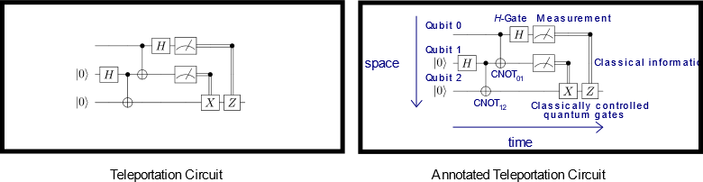

---
# Mandatory fields. See more on aka.ms/skyeye/meta.
title: Quantum circuits | Microsoft Docs 
description: Quantum circuits
services: service-name-with-dashes-AZURE-ONLY 
keywords: Don’t add or edit keywords without consulting your SEO champ.
author: QuantumWriter
ms.author: MSFT-alias-person-or-DL
ms.date: 10/09/2017
ms.topic: article-type-from-white-list
uid: microsoft.quantum.concepts.circuits
# Use only one of the following. Use ms.service for services, ms.prod for on-prem. Remove the # before the relevant field.
# ms.service: service-name-from-white-list
# product-name-from-white-list

# Optional fields. Don't forget to remove # if you need a field.
# ms.custom: can-be-multiple-comma-separated
# ms.devlang:devlang-from-white-list
# ms.suite: 
# ms.tgt_pltfrm:
# ms.reviewer:
# manager: MSFT-alias-manager-or-PM-counterpart
---

# Quantum Circuits
Consider for a moment the unitary transformation $\text{ CNOT}_{01}(H\otimes 1)$.  This gate sequence is of fundamental significance to quantum computing because it creates a maximally entangled two-qubit state:

$$\mathrm{CNOT}_{01}(H\otimes 1)|00\rangle = \frac{1}{\sqrt{2}} \left(|00\rangle + |11\rangle \right),$$

Operations with this or greater complexity are ubiquitous in quantum algorithms and quantum error correction, so it should come with great relief that there is a simple method for their visualization called a *quantum circuit diagram*.  The circuit diagram for preparing this maximally entangled quantum state is

<!---  --->
<!-- Can't find a way to easily center this... probably an extension needed:  -->

This visual language for quantum operations can be more readily digestible than writing down its equivalent matrix once you understand the conventions for expressing a quantum circuit.  We review these conventions below.

In a circuit diagram, each solid line depicts a qubit or more generally a qubit register.  By convention, the top line is qubit register $0$ and the remainder are labeled sequentially. The above example circuit is depicted as acting on two qubits (or equivalently two registers consisting of one qubit).  Gates acting on one or more qubit registers are denoted as a box.  For example, the symbol

<!---  --->
<!-- Can't find a way to easily center this... probably an extension needed:  -->

 is the Hadamard gate acting on a single-qubit register.

Quantum gates are ordered in chronological order with the left-most gate as the gate first applied to the qubits.  In other words, if you picture the wires as holding the quantum state, the wires bring the quantum state through each of the gates in the diagram from left to right.  That is to say 

<!---  --->
<!-- Can't find a way to easily center this... probably an extension needed:  -->

is the unitary matrix $CBA$.  Matrix multiplication obeys the opposite convention: the right-most matrix is applied first. In quantum circuit diagrams, however, the left-most gate is applied first.  This difference can at times lead to confusion, so it is important to note this significant difference between the linear algebraic notation and quantum circuit diagrams.

All previous examples given have had precisely the same number of wires (qubits) input to a quantum gate as the number of wires out from the quantum gate.  It may at first seem reasonable that quantum circuits could have more, or fewer, outputs than inputs in general.  This is impossible, however, because all quantum operations, save measurement, are unitary and hence reversible.  If they did not have the same number of outputs as inputs they would not be reversible and hence not unitary, which is a contradiction.  For this reason any box drawn in a circuit diagram must have precisely the same number of wires entering it as exiting it.

Multi-qubit circuit diagrams follow similar conventions to single-qubit ones.  As a clarifying example, we can define a two-qubit unitary operation $B$ to be $(H S\otimes X)$ and express the circuit equivalently as

<!---  --->
<!-- Can't find a way to easily center this... probably an extension needed:  -->

We can also view $B$ as having an action on a single two-qubit register rather than two one-qubit registers depending on the context in which the circuit is used. 
Perhaps the most useful property of such abstract circuit diagrams is that they allow complicated quantum algorithms to be described at a high level without having to compile them down to fundamental gates.  This means that you can get an intuition about the data flow for a large quantum algorithm without needing to understand all the details of how each of the subroutines within the algorithm work.

The other construct that is built into multi-qubit quantum circuit diagrams is control.  The action of a quantum singly controlled gate, denoted $\Lambda(G)$, where a single qubit's value controls the application of $G$, can be understood by looking at the following example of a product state input $\Lambda(G) (\alpha |0\rangle + \beta |1\rangle) |\psi\rangle = \alpha |0\rangle |\psi\rangle + \beta |1\rangle G|\psi \rangle$.  That is to say, the controlled gate applies $G$ to the register containing $\psi$ if and only if the control qubit takes the value $1$.  In general, we describe such controlled operations in circuit diagrams as

<!---  --->
<!-- Can't find a way to easily center this... probably an extension needed:  -->

Here the black circle denotes the quantum bit on which the gate is controlled and a vertical wire denotes the unitary that is applied when the control qubit takes the value $1$.
For the special cases where $G=X$ and $G=Z$ we introduce the following notation to describe the controlled version of the gates (note that the controlled-X gate is the $CNOT$ gate):

<!---  --->
<!-- Can't find a way to easily center this... probably an extension needed:  -->

The remaining operation to visualize in circuit diagrams is measurement.  Measurement takes a qubit register, measures it, and outputs the result as classical information.  A measurement operation is denoted by a meter symbol and always takes as input a qubit register (denoted by a solid line) and outputs classical information (denoted by a double line).  Specifically, such a subcircuit looks like 

<!---  ---->
<!-- Can't find a way to easily center this... probably an extension needed:  -->

Similarly, the subcircuit

<!---  --->
<!-- Can't find a way to easily center this... probably an extension needed:  -->

gives a classically controlled gate, where $G$ is applied conditioned on the classical control bit being value $1$.

Quantum Teleportation is perhaps the best quantum algorithm for illustrating these components.  Quantum teleportation is a method for moving data within a quantum computer (or even between distant quantum computers in a quantum network) through the use of entanglement and measurement.  Interestingly, it is actually capable of moving a quantum state, say the value in a given qubit, from one qubit to another, without even knowing what the qubit's value is! This is necessary for the protocol to work according to the laws of quantum mechanics.  The quantum teleportation circuit is given below; we also provide an annotated version of the circuit to illustrate how to read the quantum circuit.

<!--- { width=50% } --->

