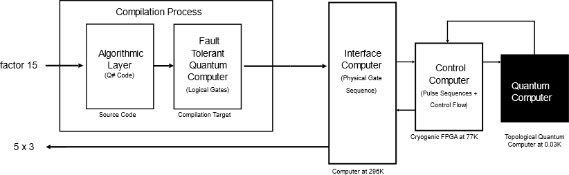

---
# Mandatory fields. See more on aka.ms/skyeye/meta.
title: Software stack | Microsoft Docs 
description: Software stack
services: service-name-with-dashes-AZURE-ONLY 
keywords: Don’t add or edit keywords without consulting your SEO champ.
author: QuantumWriter
ms.author: MSFT-alias-person-or-DL
ms.date: 10/09/2017
ms.topic: article-type-from-white-list
uid: microsoft.quantum.concepts.software-stack
# Use only one of the following. Use ms.service for services, ms.prod for on-prem. Remove the # before the relevant field.
# ms.service: service-name-from-white-list
# product-name-from-white-list

# Optional fields. Don't forget to remove # if you need a field.
# ms.custom: can-be-multiple-comma-separated
# ms.devlang:devlang-from-white-list
# ms.suite: 
# ms.tgt_pltfrm:
# ms.reviewer:
# manager: MSFT-alias-manager-or-PM-counterpart
---
# The Software Stack
Normally when we think of a computer we envision a single device running an application, but modern computing environments are much more complex and advanced. The application we interact with typically rests on multiple layers of software that provide for the application's execution down to the hardware level. These software layers are necessary to abstract the development of an application solution from the underlying complexity of the complete computing system. If a developer had to think about bus, cache architectures, communication protocols, and more while writing a simple smartphone app, the task would become much more complex.  The concept of a *software stack* was developed in classical computing to address these issues.  Borrowing from the classical concept, a software stack is also a key part of the vision behind quantum computing with Q#.  

The key idea behind a software stack is recursion.  It consists of several nested layers of interfaces that abstract the details of the lower levels of the device away from the developer.  For example, a commonly used software stack involves running ASP.NET (a programming language), on top of SQL server (a relational database management system), which runs on top of Internet Information Services (a web server), which runs on top of Windows server (an operating system), which drives the computer hardware.  By looking at software as a hierarchy, one can write software in ASP.NET without needing to understand the low-level details of all the software below it.

The software stack in quantum computing is no different in principle, and in practice operates at a lower level than traditional stacks.  What does a quantum stack look like?  A quantum computer is not a replacement for traditional (often called classical) computers.  In fact, quantum computers will almost certainly work in tandem with classical computers to solve computational problems.  In part, this arises because of the fragility of quantum data.  Quantum data is so fragile that if you even look at it you almost certainly damage the information being observed.  Quantum computers will thus need to be designed with quantum error correction in mind so that stray interactions from its physical environment do not inadvertently damage the information and computation. For this reason, a natural target for Q# is an error-corrected quantum computer (often called a *fault-tolerant* quantum computer) that accepts a list of quantum instructions (called gates or gate operations) and applies those instructions to the quantum data stored within it.  Note that if the number of qubits and gate operations in a quantum algorithm or program is small enough, error correction may not be absolutely necessary.  However as the number of qubits and gate operations grow, it will more certainly be a requirement, thus we architect our software stack and Q# to aptly and efficiently handle error correction and enable scalable, fault-tolerant quantum computing.

Error correction requires a fast and reliable computer to be run in concert with the quantum computer to correct errors as they appear in the quantum computation.  In practice, components such as field-programmable gate arrays (FPGAs) or fast cryogenic processors may be needed to identify and correct the errors faster than they naturally accumulate in the quantum computer.  As a result, a quantum computer is a hybrid machine comprised of several different computational devices that operate over a wide range of temperatures.  For this reason, it is much more helpful to think about programming a quantum computer through the lens of a software stack, as there are many layers of hardware and software (classical and quantum) required to ultimately achieve the implementation of a quantum algorithm on a quantum computer.

A conceptual stack follows which illustrates the functional flow of factoring 15 in a quantum computing environment.

There are several broad stages of programming such a quantum computation.  The first, and arguably most challenging phase, is specifying the problem that one wishes to solve.  In this case, the problem is to factor the number 15 into a product of two prime numbers.  The next step involves designing an algorithm for solving this computational problem.  In this case, Shor's famous quantum factoring algorithm can be used to find the factors.  This algorithm is expressed in Q# and then a sequence of quantum operations is output that could be run on an idealized error-free quantum computer.  

In this example, assume nature is not so kind as to provide an error-free quantum computer so the subsequent step takes the operations emitted by Q# and translates them using templates specified by the quantum error correction method chosen into physical gates that the basic hardware can execute.  This process involves replacing every logical qubit described in the previous model with a host of physical qubits that are used to store and protect the information within a single qubit in a redundant fashion that can resist local errors on the constituent physical qubits long enough for such errors to be detected and corrected.  Just as the logical qubits described by the Q# code need to be replaced with many physical qubits, similarly each quantum gate described in the output needs to be translated into a sequence of physical gates that act upon the physical qubits.  For this reason, the output of Q# is seldom the final target for quantum computing and further levels of abstraction are needed to execute the code on hardware in an oblivious fashion.

The physical gate sequence is then loaded into an ordinary computer that sends these instructions down to a control computer that interfaces directly with the quantum computer.  This layer within the software stack is often handled by experimental control software such as [QCoDeS](http://qcodes.github.io/Qcodes/).

The final step in this process involves the interface computer first streaming the gates as needed to a fast control computer. Then the fast control computer applies the voltages needed (commonly called pulses) to implement the required gates on qubits. This has to be done while correcting any errors that are observed through quantum error correction.  Cryogenic FPGAs or other exotic hardware may be needed to perform these steps within the stringent time requirements imposed by the rate at which errors appear in the quantum computer.  The target language on this level is often VHDL, which requires a distinct way of thinking from that which is used at the top end of the stack to parse a description of a quantum algorithm.

The aim of Q# is to provide a simple language that allows developers to write code that targets a wealth of quantum computing platforms and interface with the intervening layers of software that stand between the user and the quantum device.  The language facilitates this by embracing the notion of a software stack and abstracting many of the details of the underlying quantum computer while allowing other levels of the stack, exposed through a language such as C#, to perform the necessary translations from Q# code to fundamental operations.  This allows the developer to focus on what they do best: designing algorithms and solving problems.
