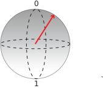

# Quickstart: Implement a Quantum Random Number Generator in Q#
A simple example of a quantum algorithm written in Q# is a quantum random number generator. This algorithm leverages the nature of quantum mechanics to produce a random number. 

## Prerequisites

- The Microsoft [Quantum Development Kit](install).
- [Create a Q# Project](xref:microsoft.quantum.howto.createproject)


## Write a Q# operation

As mentioned in our [What is Quantum Computing?](xref:microsoft.quantum.overview.what) article, a qubit is a unit of quantum information that can be in superposition. A classical bit can only take the values **0** or **1**. A qubit can exist in a quantum superposition between the two classical values **0** and **1**. However, when we measure a qubit we can only observe the states **0** or **1**. We say that a measurement *collapses* the state the qubit from the superposition to the state corresponding the classical value that we observe.

There's no unique way for a qubit to be in superposition, there are infinite ways to exist in superposition. The probabiliities of obtaining either **0** or **1** when measuring the qubit depends on the especific superposition. For example, we can have a qubit in superposition in which the probability of obtaining **1** is very high, let's say a 90%. Therefore the probability of obtaining **0** is low (10%). Or maybe we have a qubit in a different superposition in which the probabilities to obtain **0** and **1** when measuring are the same (50%). As there are infinites ways for the qubit to be in a superposition, a clever way to express the state of a qubit is the *Bolch sphere*.


### Q# operation code

1. Replace the contents of the Operation.qs file with the following code:

    ```qsharp
    namespace Quantum {
    open Microsoft.Quantum.Intrinsic;

    operation QuantumRandomNumberGenerator() : Result {
        using(q = Qubit())  { // Allocate a qubit.
            H(q);             // Put the qubit to superposition. It now has a 50% chance of being 0 or 1.
            let r = M(q);     // Measure the qubit value.
            Reset(q);
            return r;
            }
        }
    }
    ```

Here we introduce the `Qubit` datatype, native to Q#. We can only allocate a `Qubit` with a `using` statement. When it gets allocated a qubit is always in the `Zero`  state. 

Using the `H` operation, we are able to put our `Qubit` in superposition. To measure a qubit and read its value you use the `M` intrinsic operation.

By putting our `Qubit` in superposition and measuring it, our result will be a different value each time the code is invoked. 

When a `Qubit` is de-allocated it must be explicitly set back to the `Zero` state, otherwise the simulator will report a runtime error. An easy way to achieve this is invoking `Reset`.
