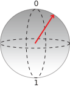
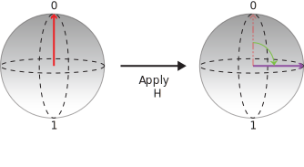
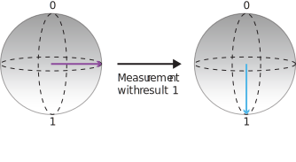

# Quickstart: Implement a Quantum Random Number Generator in Q#
A simple example of a quantum algorithm written in Q# is a quantum random number generator. This algorithm leverages the nature of quantum mechanics to produce a random number. 

## Prerequisites

- The Microsoft [Quantum Development Kit](xref:microsoft.quantum.install).
- [Create a Q# Project](xref:microsoft.quantum.howto.createproject)


## Write a Q# operation

### Q# operation code

1. Replace the contents of the Operation.qs file with the following code:

    ```qsharp
    namespace Quantum {
        open Microsoft.Quantum.Intrinsic;

        operation QuantumRandomNumberGenerator() : Result {
            using(qubit = Qubit())  { // Allocate a qubit.
                H(qubit);             // Put the qubit to superposition. It now has a 50% chance of being 0 or 1.
                let r = M(v);     // Measure the qubit value.
                Reset(qubit);
                return r;
            }
        }
    }
    ```

As mentioned in our [What is Quantum Computing?](xref:microsoft.quantum.overview.what) article, a qubit is a unit of quantum information that can be in superposition. When measured, a qubit can only be either 0 or 1. However, during execution the state of the qubit represents the probability of reading either a 0 or a 1 with a measurement. This probabilistic state is known as superposition. We can use this probability to generate random numbers.

In our Q# operation, we introduce the `Qubit` datatype, native to Q#. We can only allocate a `Qubit` with a `using` statement. When it gets allocated a qubit is always in the `Zero`  state. 

Using the `H` operation, we are able to put our `Qubit` in superposition. To measure a qubit and read its value, you use the `M` intrinsic operation.

By putting our `Qubit` in superposition and measuring it, our result will be a different value each time the code is invoked. 

When a `Qubit` is de-allocated it must be explicitly set back to the `Zero` state, otherwise the simulator will report a runtime error. An easy way to achieve this is invoking `Reset`.

### Visualizing the code with the Bloch sphere

In the Bloch sphere the north pole represents the classical value **0** and the south pole represents the classical value **1**. Any superposition can be represented by a point on the sphere (represented by an arrow). When the closer the end of the arrow to a pole, the higher the probability the qubit collapses into the classical value assigned to that pole when measured. For example, the qubit state represented by the red arrow below has a higher probability of giving the value **0** if we measure it.



We can use this representation to visualize what the code is doing:

* First we start with a qubit initalizated in the state **0** and apply `H` to create a superposition in which the probabilities for **0** and **1** are the same.



* Then we measure the qubit and save the output:



Since the outcome of the measurement is completely random, we have obtained a random bit. We can call this operation several times to create integers. For example, if we call the operation three times to obtain three random bits, we can build random 3-bit numbers (that is, a random number between 0 and 7).
