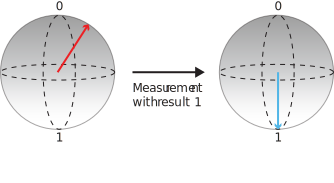

# Quickstart: Implement a Quantum Random Number Generator in Q#
A simple example of a quantum algorithm written in Q# is a quantum random number generator. This algorithm leverages the nature of quantum mechanics to produce a random number. 

## Prerequisites

- The Microsoft [Quantum Development Kit](install).
- [Create a Q# Project](xref:microsoft.quantum.howto.createproject)


## Write a Q# operation

As mentioned in our [What is Quantum Computing?](xref:microsoft.quantum.overview.what) article, a qubit is a unit of quantum information that can be in superposition. A classical bit can only take the values **0** or **1**. A qubit can exist in a quantum superposition between the two classical values **0** and **1**. However, when we measure a qubit we can only observe the states **0** or **1**. We say that a measurement *collapses* the state the qubit from the superposition to the state corresponding the classical value that we observe.

There's no unique way for a qubit to be in superposition, there are infinite ways to exist in superposition. The probabilities of obtaining either **0** or **1** when measuring the qubit depends on the specific superposition. For example, we can have a qubit in superposition in which the probability of obtaining **1** is very high, let's say a 90%. Therefore the probability of obtaining **0** is low (10%). Or maybe we have a qubit in a different superposition in which the probabilities to obtain **0** and **1** when measuring are the same (50%). As there are infinite ways for the qubit to be in a superposition, a clever way to express the state of a qubit is the *Bolch sphere*.


In the Bloch sphere the north pole represents the classical value **0** and the south pole represents the classical value **1**. Any superposition can be represented by a point in the sphere. This point is typically represented by an arrow starting at the center of the sphere (also called vector). When the closer the end of the arrow to a pole, the higher the probability the qubit collapses into the classical value assigned to that pole when measured. For example, the qubit state represented by the red arrow above has a higher probability of giving the value **0** if we measure it.

Let's visualize with the Bloch sphere how the state of the qubit transforms when we measure it. For example, suppose that we have the state depicted by the red arrow above and we measure it to be **1** (although the odds are low it can happen as well). In the Bloch sphere this process looks like this:



Measurements are not the only way to modify the state of a qubit, we can also apply operations to change the state of the qubit. As any state is represented by a point on the sphere, one operation that transforms the state of the qubit into another can also be understod as a rotation of the arrow along the sphere. For example, the most famous operation that we can apply to a qubit is the `H` operation (H stands for Hadamard, the mathematician that studied it). The `H`operation does the following: takes a qubit in the state 0 and transform it to a balanced state in which the odds of obtaining **1** and **0** are both 50%. In the Bloch sphere:


The distance of the purple arrow to each pole is the same, therefore the probabilities of obtaining **0** and **1** in a measurement are the same for both.

> [!NOTE]
> Why to use a sphere and not a circle? Since we have only two classical states it can seem that having a quarter of a circle would 
> suffice to encode all the possible superpositions. However, the superpositions in quantum mechanics are *complex* and to describe them > we need also to encode the information of the *phase* of the superposition. Therefore we need an extra dimension. For
> this exercise we don't need the phase, but later it will become an essential tool to harness the quantum world.

### Q# operation code
Let's see how we can implement the concepts showed above to create a quantum random number generator in Q#:

1. Replace the contents of the Operation.qs file with the following code:

    ```qsharp
    namespace Quantum {
    open Microsoft.Quantum.Intrinsic;

    operation QuantumRandomNumberGenerator() : Result {
        using(q = Qubit())  { // Allocate a qubit.
            H(q);             // Put the qubit to superposition. It now has a 50% chance of being 0 or 1.
            let r = M(q);     // Measure the qubit value.
            Reset(q);
            return r;
            }
        }
    }
    ```

Here we introduce the `Qubit` datatype, native to Q#. We can only allocate a `Qubit` with a `using` statement. When it gets allocated a qubit is always in the `Zero`  state. 

Using the `H` operation, we are able to put our `Qubit` in superposition. To measure a qubit and read its value you use the `M` intrinsic operation.

By putting our `Qubit` in superposition and measuring it, our result will be a different value each time the code is invoked. 

When a `Qubit` is de-allocated it must be explicitly set back to the `Zero` state, otherwise the simulator will report a runtime error. An easy way to achieve this is invoking `Reset`.
