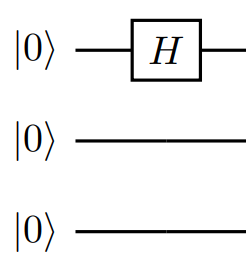

---
title: Write and simulate qubit-level programs in Q#
description: Step-by-step tutorial on writing and simulating a quantum program which operates at the individual qubit level
author: gillenhaalb
ms.author: a-gibec@microsoft.com
ms.date: 10/06/2019
uid: microsoft.quantum.circuit-tutorial
ms.topic: tutorial 
---


# Tutorial: Write and simulate qubit-level programs in Q\#

Welcome to the Quantum Development Kit tutorial on writing and simulating a basic quantum program that operates on individual qubits. 

Although Q# was primarily created as a high-level programming language for large-scale quantum programs, it can just as easily be used to explore the lower level of quantum programs: directly addressing specific qubits.
The flexibility of Q# allows users to approach quantum systems from any such level of abstraction, and in this tutorial we dive into the qubits themselves.
Specifically, we take a look under the hood of the [quantum Fourier transform](https://en.wikipedia.org/wiki/Quantum_Fourier_transform), a subroutine that is integral to many larger quantum algorithms.

Note that this low-level view of quantum information processing is often described in terms of "[quantum circuits](xref:microsoft.quantum.concepts.circuits)," which represent the sequential application of gates to specific qubits of a system.

Thus, the single- and multi-qubit operations we sequentially apply can be readily represented in a "circuit diagram."
In our case, we will define a Q# operation to perform the full three-qubit quantum Fourier transform, which has the following representation as a circuit:

<br/>


## Prerequisites

* [Install](xref:microsoft.quantum.install) the Quantum Development Kit using your preferred language and development environment.
* If you already have the QDK installed, make sure you have [updated](xref:microsoft.quantum.update) to the latest version


## In this tutorial, you'll learn how to:

> [!div class="checklist"]
> * Define quantum operations in Q#
> * Call Q# operations directly from the command line or using a classical host program
> * Simulate a quantum operation from qubit allocation to measurement output
> * Observe how the quantum system's simulated wavefunction evolves throughout the operation

Running a quantum program with Microsoft's Quantum Development Kit typically consists of two parts:
1. The program itself, which is implemented using the Q# quantum programming language, and then invoked to run on a quantum computer or quantum simulator. These consist of 
    - Q# operations: subroutines containing quantum operations, and 
    - Q# functions: classical subroutines used within the quantum algorithm.
2. The entry point used to call the quantum program and specify the target machine on which it should be run.
    This can be done directly from the command line, or through a host program written in a classical programming language like Python or C#.
    This tutorial includes instructions for whichever method you prefer.

## Allocate qubits and define quantum operations

The first part of this tutorial consists of defining the Q# operation `Perform3qubitQFT`, which performs the quantum Fourier transform on three qubits. 

In addition, we will use the [`DumpMachine`](xref:microsoft.quantum.diagnostics.dumpmachine) function to observe how the simulated wavefunction of our three qubit system evolves across the operation.

The first step is creating your Q# project and file.
The steps for this depend on the environment you will use to call the program, and you can find the details in the respective [installation guides](xref:microsoft.quantum.install).

We will walk you through the components of the file step-by-step, but the code is also available as a full block below.

### Namespaces to access other Q# operations
Inside the file, we first define the namespace `NamespaceQFT` which will be accessed by the compiler.
For our operation to make use of existing Q# operations, we open the relevant `Microsoft.Quantum.<>` namespaces.

```qsharp
namespace NamespaceQFT {
    open Microsoft.Quantum.Intrinsic;
    open Microsoft.Quantum.Diagnostics;
    open Microsoft.Quantum.Math;
    open Microsoft.Quantum.Arrays;

    // operations go here
}
```

### Define operations with arguments and returns
Next, we define the `Perform3qubitQFT` operation:

```qsharp
    operation Perform3qubitQFT() : Unit {
        // do stuff
    }
```

For now, the operation takes no arguments and does not return anything---in this case we write that it returns a `Unit` object, which is akin to `void` in C# or an empty tuple, `Tuple[()]`, in Python.
Later, we will modify it to return an array of measurement results, at which point `Unit` will be replaced by `Result[]`. 

### Allocate qubits with `using`
Within our Q# operation, we first allocate a register of three qubits with the `using` statement:

```qsharp
        using (qs = Qubit[3]) {

            Message("Initial state |000>:");
            DumpMachine();

        }
```

With `using`, the qubits are automatically allocated in the $\ket{0}$ state. We can verify this by using [`Message(<string>)`](xref:microsoft.quantum.intrinsic.message) and [`DumpMachine()`](xref:microsoft.quantum.diagnostics.dumpmachine), which print a string and the system's current state to the console.

> [!NOTE]
> The `Message(<string>)` and `DumpMachine()` functions (from [`Microsoft.Quantum.Intrinsic`](xref:microsoft.quantum.intrinsic) and [`Microsoft.Quantum.Diagnostics`](xref:microsoft.quantum.diagnostics), respectively) both print directly to the console. 
> Just like a real quantum computation, Q# does not allow us to directly access qubit states.
> However, as `DumpMachine` prints the target machine's current state, it can provide valuable insight for debugging and learning when used in conjunction with the full state simulator.


### Applying single-qubit and controlled gates

Next, we apply the gates which comprise the operation itself.
Q# already contains many basic quantum gates as operations in the [`Microsoft.Quantum.Intrinsic`](xref:microsoft.quantum.intrinsic) namespace, and these are no exception. 

Within a Q# operation, the statements invoking callables will of course be executed in sequential order.
Hence, the first gate to apply is the [`H`](xref:microsoft.quantum.intrinsic.h) (Hadamard) to the first qubit:

<br/>


To apply an operation to a specific qubit from a register (i.e. a single `Qubit` from an array `Qubit[]`) we use standard index notation.
So, applying the [`H`](xref:microsoft.quantum.intrinsic.h) to the first qubit of our register `qs` takes the form:

```qsharp
            H(qs[0]);
```

Besides applying the `H` (Hadamard) gate to individual qubits, the QFT circuit consists primarily of controlled [`R1`](xref:microsoft.quantum.intrinsic.r1) rotations.
An `R1(θ, <qubit>)` operation in general leaves the $\ket{0}$ component of the qubit unchanged, while applying a rotation of $e^{i\theta}$ to the $\ket{1}$ component.

#### Controlled operations

Q# makes it extremely easy to condition the execution of an operation upon one or multiple control qubits.
In general, we merely preface the call with `Controlled`, and the operation arguments change as:

 `Op(<normal args>)` $\to$ `Controlled Op([<control qubits>], (<normal args>))`.

Note that the control qubits must be provided as an array, even if it is a single qubit.

After the `H`, we see that the next gates are the `R1` gates acting on the first qubit (and controlled by the second/third):

<br/>


We call these with

```qsharp
            Controlled R1([qs[1]], (PI()/2.0, qs[0]));
            Controlled R1([qs[2]], (PI()/4.0, qs[0]));
```

Note that we use the [`PI()`](xref:microsoft.quantum.math.pi) function from the [`Microsoft.Quantum.Math`](xref:microsoft.quantum.math) namespace to define the rotations in terms of pi radians.
Additionally, we divide by a `Double` (e.g. `2.0`) because dividing by an integer `2` would throw a type error. 

> [!TIP]
> `R1(π/2)` and `R1(π/4)` are equivalent to the `S` and `T` operations (also in `Microsoft.Quantum.Intrinsic`).


After applying the relevant Hadamards and controlled rotations to the second and third qubits:

```qsharp
            //second qubit:
            H(qs[1]);
            Controlled R1([qs[2]], (PI()/2.0, qs[1]));

            //third qubit:
            H(qs[2]);
```

we need only apply a [`SWAP`](xref:microsoft.quantum.intrinsic.swap) gate to complete the circuit:

```qsharp
            SWAP(qs[2], qs[0]);
```

This is necessary because the nature of the quantum Fourier transform outputs the qubits in reverse order, so the swaps allow for seamless integration of the subroutine into larger algorithms.

Hence we have finished writing the qubit-level operations of the quantum Fourier transform into our Q# operation:


However, we can't call it a day just yet.
Our qubits were in state $\ket{0}$ when we allocated them, and much like in life, in Q# we should leave things the same way we found them (or better!).

### Deallocate qubits

We call [`DumpMachine()`](xref:microsoft.quantum.diagnostics.dumpmachine) again to see the post-operation state, and finally apply [`ResetAll`](xref:microsoft.quantum.intrinsic.resetall) to the qubit register to reset our qubits to $\ket{0}$ before completing the operation:

```qsharp
            Message("After:");
            DumpMachine();

            ResetAll(qs);
```

Requiring that all deallocated qubits be explicitly set to $\ket{0}$ is a basic feature of Q#, as it allows other operations to know their state precisely when they begin using those same qubits (a scarce resource).
Additionally, this assures that they not be entangled with any other qubits in the system.
If the reset is not performed at the end of a `using` allocation block, a runtime error will be thrown.

Your full Q# file should now look like this:

```qsharp
namespace NamespaceQFT {
    open Microsoft.Quantum.Intrinsic;
    open Microsoft.Quantum.Diagnostics;
    open Microsoft.Quantum.Math;
    open Microsoft.Quantum.Arrays;

    operation Perform3qubitQFT() : Unit {

        using (qs = Qubit[3]) {

            Message("Initial state |000>:");
            DumpMachine();

            //QFT:
            //first qubit:
            H(qs[0]);
            Controlled R1([qs[1]], (PI()/2.0, qs[0]));
            Controlled R1([qs[2]], (PI()/4.0, qs[0]));

            //second qubit:
            H(qs[1]);
            Controlled R1([qs[2]], (PI()/2.0, qs[1]));

            //third qubit:
            H(qs[2]);

            SWAP(qs[2], qs[0]);

            Message("After:");
            DumpMachine();

            ResetAll(qs);
        }
    }
}
```


With the Q# file and operation complete, our quantum program is ready to be called and simulated.

## Execute the program

Having defined our Q# operation in a `.qs` file, we now need to call that operation and observe any returned classical data.
For now, there isn't anything returned (recall that our operation defined above returns `Unit`), but when we later modify the Q# operation to return an array of measurement results (`Result[]`), we will address this.

While the Q# program is ubiquitous across the environments used to call it, the manner of doing so will of course vary. 
As such, simply follow the instructions in the tab corresponding to your setup: working from the Q# command line application or using a host program in Python or C#.

#### [Command line](#tab/tabid-cmdline)

Running the Q# program from the command line requires only a small change to the Q# file.

Simply add `@EntryPoint()` to a line preceding the operation definition:

```qsharp
    @EntryPoint()
    operation Perform3qubitQFT() : Unit {
        // ...
```

To run the program, open the terminal in the folder of your project and enter

```dotnetcli
dotnet run
```

Upon execution, you should see the `Message` and `DumpMachine` outputs below printed in your console.


#### [Python](#tab/tabid-python)

Create a Python host file: `host.py`.

The host file is constructed as follows: 
1. First, we import the `qsharp` module, which registers the module loader for Q# interoperability. 
    This allows Q# namespaces (e.g. the `NamespaceQFT` we defined in our Q# file) to appear as Python modules, from which we can import Q# operations.
2. Then, import the Q# operations which we will directly invoke---in this case, `Perform3qubitQFT`.
    We need only import the entry point into a Q# program (i.e. _not_ operations like `H` and `R1`, which are called by other Q# operations but never by the classical host).
3. In simulating Q# operations or functions, use the form `<Q#callable>.simulate(<args>)` to run them on the `QuantumSimulator()` target machine. 

> [!NOTE]
> If we wanted to call the operation on a different machine, for example the `ResourceEstimator()`, we would simply use `<Q#callable>.estimate_resources(<args>)`.
> In general, Q# operations are agnostic to the machines on which they're run, but some features such as `DumpMachine` may behave differently.

4. Upon performing the simulation, the operation call will return values as defined in the Q# file.
    For now there is nothing returned, but later on we will see an example of assigning and processing these values.
    With the resultant data in our hands and totally classical, we can do whatever we'd like with it.

Your full `host.py` file should be this:

```python
import qsharp
from NamespaceQFT import Perform3qubitQFT

Perform3qubitQFT.simulate()
```

Run the Python file, and printed in your console you should see the `Message` and `DumpMachine` outputs below. 


#### [C#](#tab/tabid-csharp)

Following the same [instructions](xref:microsoft.quantum.howto.createproject) as above, create a C# host file, and rename it to `host.cs`.

The C# host has four parts:
1. Construct a quantum simulator.
    In the code below, this is the variable `qsim`.
2. Compute any arguments required for the quantum algorithm.
    There are none in this example.
3. Run the quantum algorithm. 
    Each Q# operation generates a C# class with the same name. 
    This class has a `Run` method that **asynchronously** executes the operation.
    The execution is asynchronous because execution on actual hardware will be asynchronous. 
    Because the `Run` method is asynchronous, we call the `Wait()` method; this blocks execution until the task completes and returns the result synchronously. 
4. Process the returned result of the operation.
    For now, the operation returns nothing.


```csharp
using System;

using Microsoft.Quantum.Simulation.Core;
using Microsoft.Quantum.Simulation.Simulators;

namespace NamespaceQFT
{
    class Driver
    {
        static void Main(string[] args)
        {
            using (var qsim = new QuantumSimulator())
            {
                Perform3QubitQFT.Run(qsim).Wait();
            }
            
            System.Console.WriteLine("Press any key to continue...");
            Console.ReadKey();
        }
    }
}

```
Run the application, and your output should match that below.
The program will exit after you press a key.
***

```Output
Initial state |000>:
# wave function for qubits with ids (least to most significant): 0;1;2
|0>:	 1.000000 +  0.000000 i	 == 	******************** [ 1.000000 ]     --- [  0.00000 rad ]
|1>:	 0.000000 +  0.000000 i	 == 	                     [ 0.000000 ]                   
|2>:	 0.000000 +  0.000000 i	 == 	                     [ 0.000000 ]                   
|3>:	 0.000000 +  0.000000 i	 == 	                     [ 0.000000 ]                   
|4>:	 0.000000 +  0.000000 i	 == 	                     [ 0.000000 ]                   
|5>:	 0.000000 +  0.000000 i	 == 	                     [ 0.000000 ]                   
|6>:	 0.000000 +  0.000000 i	 == 	                     [ 0.000000 ]                   
|7>:	 0.000000 +  0.000000 i	 == 	                     [ 0.000000 ]                   
After:
# wave function for qubits with ids (least to most significant): 0;1;2
|0>:	 0.353553 +  0.000000 i	 == 	***                  [ 0.125000 ]     --- [  0.00000 rad ]
|1>:	 0.353553 +  0.000000 i	 == 	***                  [ 0.125000 ]     --- [  0.00000 rad ]
|2>:	 0.353553 +  0.000000 i	 == 	***                  [ 0.125000 ]     --- [  0.00000 rad ]
|3>:	 0.353553 +  0.000000 i	 == 	***                  [ 0.125000 ]     --- [  0.00000 rad ]
|4>:	 0.353553 +  0.000000 i	 == 	***                  [ 0.125000 ]     --- [  0.00000 rad ]
|5>:	 0.353553 +  0.000000 i	 == 	***                  [ 0.125000 ]     --- [  0.00000 rad ]
|6>:	 0.353553 +  0.000000 i	 == 	***                  [ 0.125000 ]     --- [  0.00000 rad ]
|7>:	 0.353553 +  0.000000 i	 == 	***                  [ 0.125000 ]     --- [  0.00000 rad ]
```

When called on the full-state simulator, `DumpMachine()` provides these mutliple representations of the quantum state's wavefunction. 
The possible states of an $n$-qubit system can be represented by $2^n$ computational basis states, each with a corresponding complex coefficient (simply an amplitude and a phase).
The computational basis states correspond to all the possible binary strings of length $n$---that is, all the possible combinations of qubit states $\ket{0}$ and $\ket{1}$, where each binary digit corresponds to an individual qubit.

The first row provides a comment with the IDs of the corresponding qubits in their significant order.
Qubit `2` being the "most significant" simply means that in the binary representation of basis state vector $\ket{i}$, the state of qubit `2` corresponds to the left-most digit. 
For example, $\ket{6} = \ket{110}$ comprises qubits `2` and `1` both in $\ket{1}$ and qubit `0` in $\ket{0}$.


The rest of the rows describe the probability amplitude of measuring the basis state vector $\ket{i}$ in both Cartesian and polar formats.
In detail for the first row of our input state $\ket{000}$:
* **`|0>:`** this row corresponds to the `0` computational basis state (given that our initial state post-allocation was $\ket{000}$, we would expect this to be the only state with probability amplitude at this point).
* **`1.000000 +  0.000000 i`**: the probability amplitude in Cartesian format.
* **` == `**: the `equal` sign separates both equivalent representations.
* **`********************`**: A graphical representation of the magnitude, the number of `*` is proportionate to the probability of measuring this state vector. 
* **`[ 1.000000 ]`**: the numeric value of the magnitude
* **`    ---`**: A graphical representation of the amplitude's phase.
* **`[ 0.0000 rad ]`**: the numeric value of the phase (in radians).

Both the magnitude and the phase are displayed with a graphical representation. The magnitude representation is straightforward: it shows a bar of `*`, and the higher the probability, the larger the bar will be. For the phase, see the DumpMachine section [here](xref:microsoft.quantum.techniques.testing-and-debugging#dump-functions) for the possible symbol representations based on angle ranges.


So, the printed output is illustrating that our programmed gates transformed our state from

$$
\ket{\psi}\_{initial} = \ket{000}
$$

to 

$$
\begin{align}
    \ket{\psi}\_{final} &= \frac{1}{\sqrt{8}} \left( \ket{000} + \ket{001} + \ket{010} + \ket{011} + \ket{100} + \ket{101} + \ket{110} + \ket{111}  \right) \\\\
    &= \frac{1}{\sqrt{2^n}}\sum\_{j=0}^{2^n-1} \ket{j},
\end{align}
$$

which is precisely the behavior of the 3-qubit Fourier transform. 

If you are curious about how other input states are affected, we encourage you to play around with applying qubit operations before the transform.

## Adding measurements

Unfortunately, a cornerstone of quantum mechanics tells us that a real quantum system cannot have such a `DumpMachine` function. 
Instead, we're forced to extract information through measurements, which in general not only fail to provide us the full quantum state, but can also drastically alter the system itself.
There are many sorts of quantum measurements, but we will focus on the most basic: projective measurements on single qubits.
Upon measurement in a given basis (e.g. the computational basis $ \{ \ket{0}, \ket{1} \} $), the qubit state is projected onto whichever basis state was measured---hence destroying any superposition between the two.

To implement measurements within a Q# program, we use the `M` operation (from `Microsoft.Quantum.Intrinsic`), which returns a `Result` type.

First, we modify our `Perform3QubitQFT` operation to return an array of measurement results, `Result[]`, instead of `Unit`.

```qsharp
    operation Perform3QubitQFT() : Result[] {
```

#### Define and initialize `Result[]` array

Before even allocating qubits (i.e. before the `using` statement), we declare and bind this length-3 array (one `Result` for each qubit): 

```qsharp
        mutable resultArray = new Result[3];
```

The `mutable` keyword prefacing `resultArray` allows the variable to be rebound later in the code---for example, when adding our measurement results.

#### Perform measurements in a `for` loop and add results to array

After the Fourier transform operations inside the `using` block, insert the following code:

```qsharp
            for(i in IndexRange(qs)) {
                set resultArray w/= i <- M(qs[i]);
            }
```
The [`IndexRange`](xref:microsoft.quantum.arrays.indexrange) function called on an array (e.g. our array of qubits, `qs`) returns a range over the indices of the array. 
Here, we use it in our `for` loop to sequentially measure each qubit using the `M(qs[i])` statement.
Each measured `Result` type (either `Zero` or `One`) is then added to the corresponding index position in `resultArray` with an update-and-reassign statement.

> [!NOTE]
> The syntax of this statement is unique to Q#, but corresponds to the similar variable reassignment `resultArray[i] <- M(qs[i])` seen in other languages such as F# and R.

The keyword `set` is always used to reassign variables bound using `mutable`.

#### Return `resultArray`

With all three qubits measured and the results added to `resultArray`, we are safe to reset and deallocate the qubits as before.
After the `using` block's close, insert

```qsharp
        return resultArray;
```
to ultimately return the output of our operation. 

### Understanding the effects of measurement

Let's change the placement of our `DumpMachine` functions to output the state before and after the measurements.
The final operation code should look like: 

```qsharp
    operation Perform3QubitQFT() : Result[] {

        mutable resultArray = new Result[3];

        using (qs = Qubit[3]) {

            //QFT:
            //first qubit:
            H(qs[0]);
            Controlled R1([qs[1]], (PI()/2.0, qs[0]));
            Controlled R1([qs[2]], (PI()/4.0, qs[0]));

            //second qubit:
            H(qs[1]);
            Controlled R1([qs[2]], (PI()/2.0, qs[1]));

            //third qubit:
            H(qs[2]);

            SWAP(qs[2], qs[0]);

            Message("Before measurement: ");
            DumpMachine();

            for(i in IndexRange(qs)) {
                set resultArray w/= i <- M(qs[i]);
            }

            Message("After measurement: ");
            DumpMachine();

            ResetAll(qs);
        }
        return resultArray;
    }
}
```

If you are working from the command line, the returned array will simply be printed directly to the console at the end of the execution.
Otherwise, update your host program to process the returned array.

#### [Command line](#tab/tabid-cmdline)

To have more understanding of the returned array which will be printed in the console, we can add another `Message` in the Q# file just before the `return` statement:

```qsharp
        Message("Post-QFT measurement results [qubit0, qubit1, qubit2]: ");
        return resultArray;
```

Run the project, and your output should look similar to the following:

```Output
Before measurement: 
# wave function for qubits with ids (least to most significant): 0;1;2
|0>:     0.353553 +  0.000000 i  ==     ***                  [ 0.125000 ]     --- [  0.00000 rad ]
|1>:     0.353553 +  0.000000 i  ==     ***                  [ 0.125000 ]     --- [  0.00000 rad ]
|2>:     0.353553 +  0.000000 i  ==     ***                  [ 0.125000 ]     --- [  0.00000 rad ]
|3>:     0.353553 +  0.000000 i  ==     ***                  [ 0.125000 ]     --- [  0.00000 rad ]
|4>:     0.353553 +  0.000000 i  ==     ***                  [ 0.125000 ]     --- [  0.00000 rad ]
|5>:     0.353553 +  0.000000 i  ==     ***                  [ 0.125000 ]     --- [  0.00000 rad ]
|6>:     0.353553 +  0.000000 i  ==     ***                  [ 0.125000 ]     --- [  0.00000 rad ]
|7>:     0.353553 +  0.000000 i  ==     ***                  [ 0.125000 ]     --- [  0.00000 rad ]
After measurement:
# wave function for qubits with ids (least to most significant): 0;1;2
|0>:     0.000000 +  0.000000 i  ==                          [ 0.000000 ]
|1>:     0.000000 +  0.000000 i  ==                          [ 0.000000 ]
|2>:     0.000000 +  0.000000 i  ==                          [ 0.000000 ]
|3>:     1.000000 +  0.000000 i  ==     ******************** [ 1.000000 ]     --- [  0.00000 rad ]
|4>:     0.000000 +  0.000000 i  ==                          [ 0.000000 ]
|5>:     0.000000 +  0.000000 i  ==                          [ 0.000000 ]
|6>:     0.000000 +  0.000000 i  ==                          [ 0.000000 ]
|7>:     0.000000 +  0.000000 i  ==                          [ 0.000000 ]

Post-QFT measurement results [qubit0, qubit1, qubit2]: 
[One,One,Zero]
```

#### [Python](#tab/tabid-python)

Update your Python program to the following:

```python
import qsharp
from NamespaceQFT import Perform3QubitQFT

measurementResult = Perform3QubitQFT.simulate()
print("\n")
print("Measured post-QFT state: [qubit0, qubit1, qubit2]")
print(measurementResult)

# reversing order to show corresponding basis state in binary form
binaryCompBasisState = ""
for i in measurementResult:
    binaryCompBasisState = str(i) + binaryCompBasisState
print("Corresponding basis state in binary:")
print("|" + binaryCompBasisState + ">")
```

Run the file, and your output should look similar to the following:

```Output
Before measurement: 
# wave function for qubits with ids (least to most significant): 0;1;2
|0>:	 0.353553 +  0.000000 i	 == 	***                  [ 0.125000 ]     --- [  0.00000 rad ]
|1>:	 0.353553 +  0.000000 i	 == 	***                  [ 0.125000 ]     --- [  0.00000 rad ]
|2>:	 0.353553 +  0.000000 i	 == 	***                  [ 0.125000 ]     --- [  0.00000 rad ]
|3>:	 0.353553 +  0.000000 i	 == 	***                  [ 0.125000 ]     --- [  0.00000 rad ]
|4>:	 0.353553 +  0.000000 i	 == 	***                  [ 0.125000 ]     --- [  0.00000 rad ]
|5>:	 0.353553 +  0.000000 i	 == 	***                  [ 0.125000 ]     --- [  0.00000 rad ]
|6>:	 0.353553 +  0.000000 i	 == 	***                  [ 0.125000 ]     --- [  0.00000 rad ]
|7>:	 0.353553 +  0.000000 i	 == 	***                  [ 0.125000 ]     --- [  0.00000 rad ]
After measurement: 
# wave function for qubits with ids (least to most significant): 0;1;2
|0>:	 0.000000 +  0.000000 i	 == 	                     [ 0.000000 ]                   
|1>:	 0.000000 +  0.000000 i	 == 	                     [ 0.000000 ]                   
|2>:	 0.000000 +  0.000000 i	 == 	                     [ 0.000000 ]                   
|3>:	 1.000000 +  0.000000 i	 == 	******************** [ 1.000000 ]     --- [  0.00000 rad ]
|4>:	 0.000000 +  0.000000 i	 == 	                     [ 0.000000 ]                   
|5>:	 0.000000 +  0.000000 i	 == 	                     [ 0.000000 ]                   
|6>:	 0.000000 +  0.000000 i	 == 	                     [ 0.000000 ]                   
|7>:	 0.000000 +  0.000000 i	 == 	                     [ 0.000000 ]                   

Post-QFT measurement results [qubit0, qubit1, qubit2]: 
[1, 1, 0]

Corresponding basis state in binary:
|011>
```

#### [C#](#tab/tabid-csharp)

Now that our operation is returning a result, replace the method call `Wait()` with fetching the `Result` property. 
This still accomplishes the same synchronicity discussed earlier, and we can directly bind this value to the variable `measurementResult`.

```csharp
using System;

using Microsoft.Quantum.Simulation.Core;
using Microsoft.Quantum.Simulation.Simulators;

namespace NamespaceQFT
{
    class Driver
    {
        static void Main(string[] args)
        {
            using (var qsim = new QuantumSimulator())
            {
                var measurementResult = Perform3QubitQFT.Run(qsim).Result;
                System.Console.WriteLine(
                    $"Post-QFT measurement results [qubit0, qubit1, qubit2]: ");
                System.Console.WriteLine(
                    measurementResult);

                // reversing order to show corresponding basis state in binary form
                string binaryCompBasisState = String.Empty;

                foreach (Result i in measurementResult)
                {
                    string iString = i.ToString();
                    binaryCompBasisState = iString + binaryCompBasisState;
                }
                binaryCompBasisState = "|" + binaryCompBasisState + ">";
                System.Console.WriteLine(
                    $"Corresponding basis state in binary:");
                System.Console.WriteLine(
                    binaryCompBasisState);
            }
            
            System.Console.WriteLine("Press any key to continue...");
            Console.ReadKey();
        }
    }
}
```

Run the project, and your output should look similar to the following:

```Output
Before measurement: 
# wave function for qubits with ids (least to most significant): 0;1;2
|0>:     0.353553 +  0.000000 i  ==     ***                  [ 0.125000 ]     --- [  0.00000 rad ]
|1>:     0.353553 +  0.000000 i  ==     ***                  [ 0.125000 ]     --- [  0.00000 rad ]
|2>:     0.353553 +  0.000000 i  ==     ***                  [ 0.125000 ]     --- [  0.00000 rad ]
|3>:     0.353553 +  0.000000 i  ==     ***                  [ 0.125000 ]     --- [  0.00000 rad ]
|4>:     0.353553 +  0.000000 i  ==     ***                  [ 0.125000 ]     --- [  0.00000 rad ]
|5>:     0.353553 +  0.000000 i  ==     ***                  [ 0.125000 ]     --- [  0.00000 rad ]
|6>:     0.353553 +  0.000000 i  ==     ***                  [ 0.125000 ]     --- [  0.00000 rad ]
|7>:     0.353553 +  0.000000 i  ==     ***                  [ 0.125000 ]     --- [  0.00000 rad ]
After measurement:
# wave function for qubits with ids (least to most significant): 0;1;2
|0>:     0.000000 +  0.000000 i  ==                          [ 0.000000 ]
|1>:     0.000000 +  0.000000 i  ==                          [ 0.000000 ]
|2>:     0.000000 +  0.000000 i  ==                          [ 0.000000 ]
|3>:     1.000000 +  0.000000 i  ==     ******************** [ 1.000000 ]     --- [  0.00000 rad ]
|4>:     0.000000 +  0.000000 i  ==                          [ 0.000000 ]
|5>:     0.000000 +  0.000000 i  ==                          [ 0.000000 ]
|6>:     0.000000 +  0.000000 i  ==                          [ 0.000000 ]
|7>:     0.000000 +  0.000000 i  ==                          [ 0.000000 ]

Post-QFT measurement results [qubit0, qubit1, qubit2]: 
[One,One,Zero]

Corresponding basis state in binary:
|ZeroOneOne>

Press any key to continue...
```
***

This output illustrates a few different things:
1. Comparing the returned result to the pre-measurement `DumpMachine`, it clearly does _not_ illustrate the post-QFT superposition over basis states.
    A measurement only returns a single basis state, with a probability determined by the amplitude of that state in the system's wavefunction.
2. From the post-measurement `DumpMachine`, we see that measurement _changes_ the state itself, projecting it from the initial superposition over basis states to the single basis state that corresponds to the measured value.

If we were to repeat this operation many times, we would see the result statistics begin to illustrate the equally weighted superposition of the post-QFT state that gives rise to a random result on each shot.
_However_, besides being inefficient and still imperfect, this would nevertheless only reproduce the relative amplitudes of the basis states, not the relative phases between them.
The latter is not an issue in this example, but we would see relative phases appear if given a more complex input to the QFT than $\ket{000}$.

#### Partial measurements 
To explore how measuring only some qubits of the register can affect the system's state, try adding the following inside the `for` loop, after the measurement line:
```qsharp
                let iString = IntAsString(i);
                Message("After measurement of qubit " + iString + ":");
                DumpMachine();
```

Note that to access the `IntAsString` function you will have to add 
```qsharp
    open Microsoft.Quantum.Convert;
```
with the rest of the namespace `open` statements.

In the resulting output, you will see the gradual projection into subspaces as each qubit is measured.


## Use the Q# libraries
As we mentioned in the introduction, much of Q#'s power rests in the fact that it allows you to abstract-away the worries of dealing with individual qubits.
Indeed, if you want to develop full-scale, applicable quantum programs, worrying about whether a Hadamard goes before or after a particular rotation would only slow you down. 

The Q# libraries contain the [QFT](xref:microsoft.quantum.canon.qft) operation, which you can simply take and apply for any number of qubits.
To give it a try, define a new operation in your Q# file which has the same contents of `Perform3QubitQFT`, but with everything from the first `H` to the `SWAP` replaced by two easy lines:
```qsharp
            let register = BigEndian(qs);    //from Microsoft.Quantum.Arithmetic
            QFT(register);                   //from Microsoft.Quantum.Canon
```
The first line simply creates a [`BigEndian`](xref:microsoft.quantum.arithmetic.bigendian) expression of the allocated array of qubits, `qs`, which is what the [QFT](xref:microsoft.quantum.canon.qft) operation takes as an argument.
This corresponds to index ordering of the qubits in the register.

To have access to these operations, add `open` statements for their respective namespaces at the beginning of the Q# file:
```qsharp
    open Microsoft.Quantum.Canon;
    open Microsoft.Quantum.Arithmetic;
```

Now, adjust your host program to call the name of your new operation (e.g. `PerformIntrinsicQFT`), and give it a whirl.

To see the real benefit of using the Q# library operations, change the number of qubits to something other than `3`:
```qsharp
        mutable resultArray = new Result[4]; 

        using (qs = Qubit[4]) {
            //...
        }
```
You can thus apply the proper QFT for any given number of qubits, without having to worry about the mess of new Hadamards and rotations on each qubit.

Note that the quantum simulator takes exponentially more time to run as you increase the number of qubits---precisely why we look forward to real quantum hardware!


